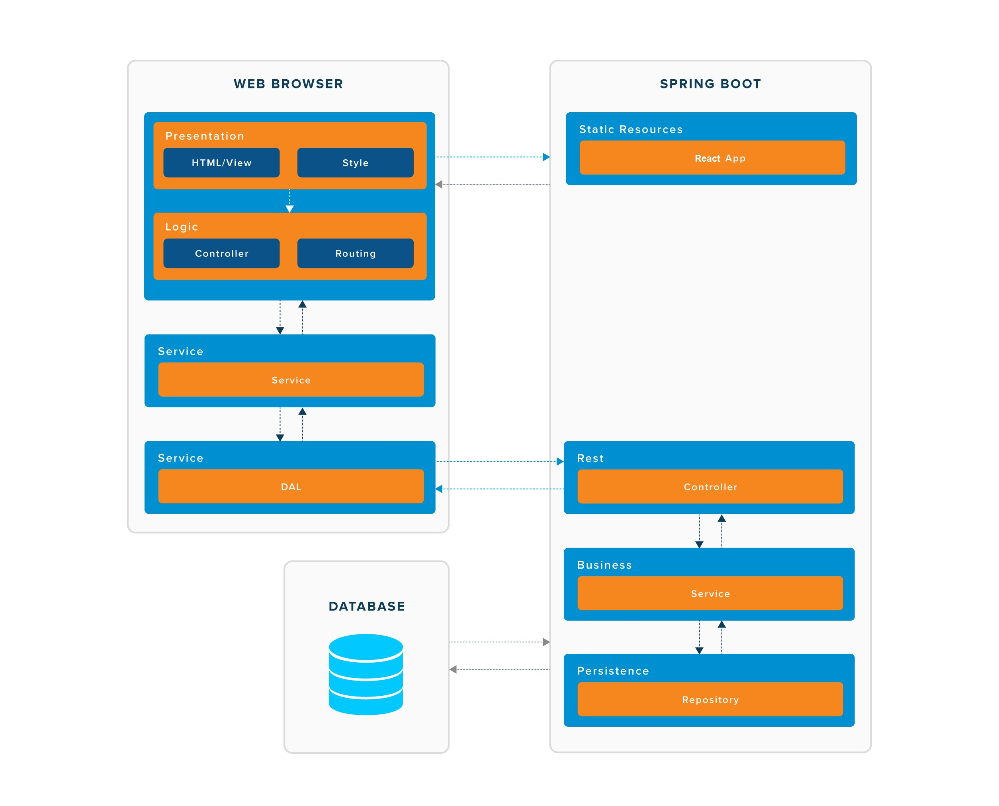

Introduction 
-----------
This is a CV management system that can be used as a reference architecture to build a full-stack application. This system is built with the following technologies:

-   [Spring boot](https://spring.io/projects/spring-boot) for server side web pages and services

-   [ReactJS](https://reactjs.org/) for client side rich user interfaces

-   [MongoDB](https://www.mongodb.com/) for persistant file storage

-   [Docker](https://www.docker.com/) for a standard run-time environment

Prerequisite
-----
Prior to running this application we need to setup our windows environments by following these steps:

Step 1:
Open up a command prompt as an administrator and install the Windows package manager using the following command:
```
@"%SystemRoot%\System32\WindowsPowerShell\v1.0\powershell.exe" -NoProfile -InputFormat None -ExecutionPolicy Bypass -Command "iex ((New-Object System.Net.WebClient).DownloadString('https://chocolatey.org/install.ps1'))" && SET "PATH=%PATH%;%ALLUSERSPROFILE%\chocolatey\bin"
```
Step 2:
Using the Windows package manager install virtualbox and docker toolbox using the following commands:
```
choco install -y  virtualbox
choco install -y docker-toolbox -ia /TASKS="desktopicon,modifypath,upgradevm"
choco install -y maven
```
Step 3:
Close the current command prompt and open the Docker Quickstart Terminal (icon on is on your desktop)


Project Management
---------------
This project used an Agile methodology using the follow example task board: https://trello.com/b/lu4XPoxP/trainer-app

The Task Board allowed time and resources to be allocated for each task that had to be completed to complete the project.

Architecture
---------------
The following diagram shows the high level reference architecture for the application: 

Running the application
-----
Step 1:
Make a directory for your work and clone this project using the following command:
```
mkdir -p ~/projects && cd $_
git clone https://github.com/Matt25969/matt-cv.git && cd matt-cv
```
Step 2:
Navigate to the cv-service folder and run the following command.
```
mvn clean install
```
Step 3:
Navigate to the cv-automation folder and run the following commands.
```
docker-compose up -d --build
```
Step 4:
Access the applicaton by accessing the following URL in the browser
```
http://192.168.99.100:3000/
```
